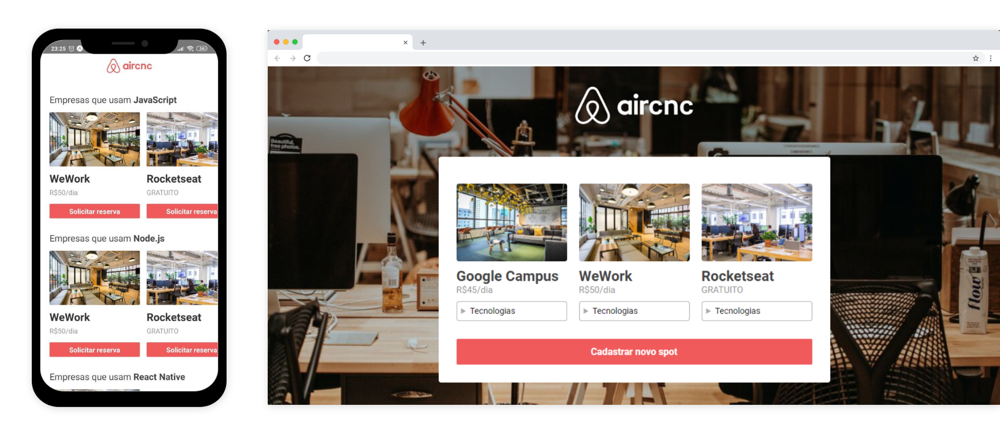

<div align="center">
  
  <h2>☕ Code and Coffee</h2>


  

</div>

## 💡 Projeto

Inspirado no Airbnb. A ideia do projeto é conectar empresas e desenvolvedores que procuram um lugar em comum para se conhecer

## 💻 Demo

[https://aircnc-web.herokuapp.com/](https://aircnc-web.herokuapp.com/)

### 📱 App

[Download para Android](https://github.com/jeferson-sb/aircnc/releases/tag/1.0.0)

## 🚀 Quick start

### Instalação

```bash
$ git clone https://github.com/jeferson-sb/aircnc.git && cd aircnc
$ cd backend && yarn
```

```bash
$ cd .. & cd frontend
$ yarn
```

### Utilização

```
Renomeie os arquivos .env.example para .env
```

```bash
$ cd backend
$ yarn dev
```

Abra uma outra aba no terminal, abra pasta raíz do projeto e rode

```bash
$ cd frontend
$ yarn start
```

## 📝 Licença

Este projeto está sob a licença [MIT](https://github.com/jeferson-sb/aircnc/blob/master/LICENSE)
